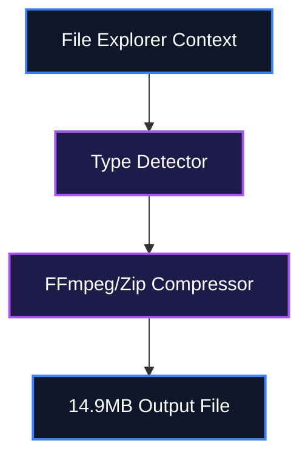

<!--
  MASTER README TEMPLATE
  Copy this file into any new or existing repository as README.md and fill in every
  [BRACKETED] field. Delete any optional section (Mathematical Foundations, Screenshots)
  that does not apply to the project. Keep section ordering consistent across repos —
  this is what makes a portfolio look like one coherent body of work instead of
  twenty unrelated dumps.
-->

# ⚡ Compress — File & Media Compressor

[](LICENSE)
[](#)
[](#)
[](#)

A headless media and file compressor designed for Windows File Explorer. Right-click any video, audio, image, or document to instantly compress it to under 15 MB for Discord sharing.

---

## 📖 Table of Contents
- [Key Features](#-key-features)
- [System Architecture](#%EF%B8%8F-system-architecture)
- [Quick Setup & Installation](#-quick-setup--installation)
- [How to Use](#-how-to-use)
- [File Structure](#-file-structure)
- [License](#-license)

---

## ✨ Key Features

- Context Menu Integration: Zero-GUI compression via Windows Explorer.
- Video Optimization: 2-pass target size scaling.
- Hardware Acceleration: NVENC, AMF, QSV auto-detection.
- Universal Support: Handles media, PDFs, and generic archives.

---

## ⚙️ System Architecture

File processing pipeline through FFmpeg and packaging modules.



---

## 🚀 Quick Setup & Installation

### Prerequisites (Zero-Dependency Setup)
This guide assumes a clean machine with **no pre-installed tools**.

```cmd
winget install --id Python.Python.3.11 -e --accept-source-agreements --accept-package-agreements
winget install --id Gyan.FFmpeg -e --accept-source-agreements --accept-package-agreements
```

🔍 **Verification Command**:
```cmd
python --version
```
*Expected Output*: `Python 3.11.x`

### Clone & Install
```bash
git clone https://github.com/IamOumarIbrahim/Compress.git
cd Compress
pip install -r requirements.txt
```

### Run
```bash
python compress.py --install
```

---

## 🛠️ How to Use

1. Right-click any file in Windows Explorer.
2. Select Compress for discord.
3. Wait for the compressed file to appear.

```bash
# Example command
python compress.py "video.mp4" -s 8.0
```

---

## 📁 File Structure

Compress/
├── compress.py - Core compressor engine
├── scripts/
│ ├── install_context_menu.bat - Registry setup
│ └── uninstall_context_menu.bat - Registry cleanup
├── requirements.txt
└── README.md

---

## 📄 License
This repository is licensed under the [MIT License](LICENSE).
