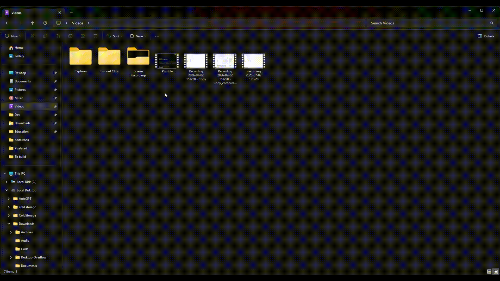
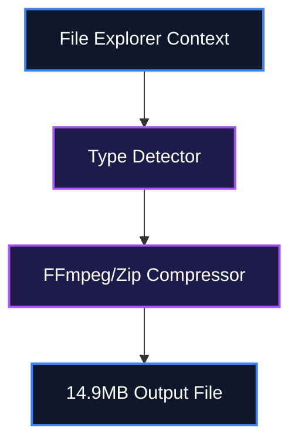

<div align="center">
  <h1>⚡ Compress</h1>
  <p><strong>Headless media and file compressor designed for Windows File Explorer context menus</strong></p>

  <p>
    <a href="https://www.python.org/"></a>
    <a href="LICENSE"></a>
    
    
  </p>
</div>

<p align="center">
  
</p>

> [!IMPORTANT]
> **Software Requirement**: Requires Python 3.8+ and FFmpeg to be installed and available in the system PATH.

Compress is a headless media and file compressor designed for Windows File Explorer. Right-click any video, audio, image, or document to instantly compress it to under 15 MB for Discord sharing. It leverages FFmpeg with hardware acceleration and auto-detection, bringing powerful CLI media optimization tools directly to your mouse clicks.

<br />

## 📖 Table of Contents
- [What is Compress?](#-what-is-compress)
- [Key Features](#-key-features)
- [System Architecture](#-system-architecture)
- [Setup & Installation](#-setup--installation)
- [How to Use](#-how-to-use)
- [Reference Tables](#-reference-tables)
- [Scope & Limitations](#-scope--limitations)
- [File Structure](#-file-structure)
- [Troubleshooting](#-troubleshooting)
- [Contributing](#-contributing)
- [License](#-license)

---

## 💡 What is Compress?

Users often struggle to share large media files over platforms like Discord due to strict file size limits (e.g., 25MB or 15MB). Compress eliminates the need to manually open bulky video editing software or upload files to sketchy web compressors.

Instead of manual video encoding, Compress integrates right into your OS:
- **Context Menu Integration**: Zero-GUI compression via Windows Explorer.
- **Universal Support**: Handles media, PDFs, and generic archives automatically.
- **Hardware Acceleration**: NVENC, AMF, QSV auto-detection for blazing fast speeds.

---

## ✨ Key Features

- 🖱️ **Context Menu Integration**: Right-click native OS integration without needing to open a GUI application.
- 🎯 **Video Optimization**: 2-pass target size scaling algorithm to hit the < 15MB goal with maximum quality.
- 🏎️ **Hardware Acceleration**: Automatically detects and utilizes GPU encoders (NVENC for NVIDIA, AMF for AMD, QSV for Intel).
- 📦 **Universal Support**: Seamlessly processes video, audio, image formats, PDFs, and automatically zips generic archives.

---

## ⚙️ System Architecture

File processing pipeline through FFmpeg and packaging modules.



> [!NOTE]
> **Design Decision**: A headless architecture was chosen over a GUI to maximize speed and friction-less usage directly from where the files live in the file system.

---

## 🚀 Setup & Installation

### Option A: 1-Click Setup (Windows)
```cmd
winget install --id Python.Python.3.11 -e --accept-source-agreements --accept-package-agreements
winget install --id Gyan.FFmpeg -e --accept-source-agreements --accept-package-agreements
```
Installs Python 3.11 and FFmpeg prerequisites automatically on a clean machine.

### Option B: Manual Installation

```bash
git clone https://github.com/IamOumarIbrahim/Compress.git
cd Compress
pip install -r requirements.txt
```

🔍 **Verification Command**:
```bash
python --version
```
*Expected Output*: `Python 3.11.x`

---

## 🖥️ How to Use

1. Right-click any file in Windows Explorer.
2. Select `Compress for discord` from the context menu.
3. Wait for the compressed file to appear alongside the original.

```bash
# Example CLI usage (if bypassing the context menu)
python compress.py "video.mp4" -s 8.0
```

---

## 📊 Reference Tables

| CLI Flag | Argument | Description |
| :--- | :--- | :--- |
| `--install` | None | Installs the Windows Explorer context menu registry keys |
| `-s` | `float` | Target file size in MB (e.g. 8.0) |

---

## 🔬 Scope & Limitations

- **Windows Specific**: The context menu installation relies on the Windows Registry, making it incompatible with Linux/macOS file managers.
- **Hardcoded Target Size**: Optimized specifically for Discord's limits; extreme custom sizing may require modifying the Python script.

---

## 📁 File Structure

```
Compress/
├── assets/
│   └── demo.gif                 - Demo preview animation
├── compress.py                  - Core compressor engine
├── scripts/
│   ├── install_context_menu.bat - Registry setup
│   └── uninstall_context_menu.bat - Registry cleanup
├── requirements.txt             - Python dependencies
└── README.md                    - Project documentation
```

---

## 🩹 Troubleshooting

| Issue | Root Cause | Resolution |
| :--- | :--- | :--- |
| Compression fails instantly | FFmpeg not in PATH | Install FFmpeg and ensure it is added to the system Environment Variables |
| Context menu missing | Registry keys not applied | Run `python compress.py --install` as Administrator |

---

## 🧩 Contributing

To add support for new file types, modify the `Type Detector` logic in `compress.py` and submit a Pull Request with the corresponding processing function.

---

## 📄 License
MIT License © 2026 IamOumarIbrahim(https://github.com/IamOumarIbrahim)

## 🙏 Powered By
[FFmpeg](https://ffmpeg.org/) · [Python](https://www.python.org/)

<div align="center">

If Compress saved your Discord sharing workflow, a ⭐ helps other people find it.

</div>
