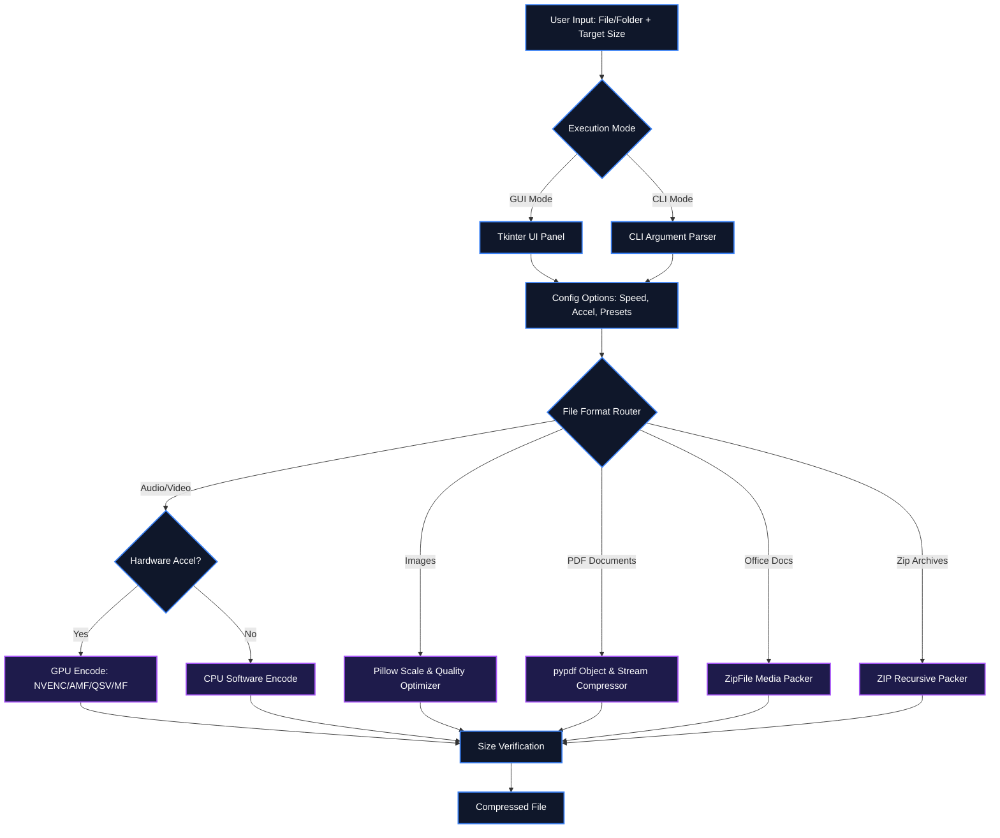

# ⚡ Media Compressor Pro (v2.5)

[](https://www.python.org/)
[](https://ffmpeg.org/)
[](https://python-pillow.org/)
[](https://pypi.org/project/pypdf/)
[](https://pyinstaller.org/)
[](https://creativecommons.org/publicdomain/zero/1.0/)

A premium, multi-format media compression utility featuring a dual-pane desktop GUI and a powerful command-line interface. Precisely compress and convert audio, video, images, PDFs, Office documents, and ZIP archives to fit target sizes (such as **15MB** limits for messaging systems, email attachments, or web uploads).

Featuring **GPU hardware acceleration** and **parallel batch worker queues**, this tool is designed to be lightning-fast.

---

## 📖 Table of Contents
- [Key Features](#-key-features)
- [System Architecture](#-system-architecture)
- [Quick Setup & Installation](#-quick-setup--installation)
- [How to Use](#-how-to-use)
  - [Option A: Graphical Interface (GUI)](#option-a-graphical-interface-gui)
  - [Option B: Command-Line Interface (CLI)](#option-b-command-line-interface-cli)
- [Double-Click Batch Scripts](#-double-click-batch-scripts)
- [Standalone Executable Build (`.exe`)](#-standalone-executable-build-exe)
- [License](#-license)

---

## ✨ Key Features

- 📁 **Universal Format Support & Conversion**: 
  - **Audio**: `.mp3`, `.m4a`, `.wav`, `.flac`, `.ogg`, `.aac`, `.wma`
  - **Video**: `.mp4`, `.mkv`, `.avi`, `.mov`, `.webm`, `.flv`, `.wmv`
  - **Images**: `.jpg`, `.jpeg`, `.png`, `.gif`, `.webp`, `.bmp`, `.tiff`
  - **PDF Documents**: `.pdf`
  - **Office Documents**: `.docx`, `.pptx`, `.xlsx`
  - **Archives**: `.zip`
- 🛡️ **Non-Destructive Copy Framework (v2.0)**:
  - Original files and folders are **never** modified or overwritten.
  - Automatically checks and increments names if target output files exist (e.g. `video_compressed (1).mp4`) to prevent destruction of old work.
- 🩺 **Runtime Self-Healing Framework (v2.0)**:
  - Automatically detects and installs missing Python libraries (`customtkinter`, `Pillow`, `pypdf`) via pip.
  - Auto-checks for FFmpeg and attempts background download via winget if missing.
  - Recoverable task architecture (auto-switches failed GPU encodings to safe CPU modes or alternative codecs).
- ⚡ **Fastest Processing & Simplified GUI (v2.5)**:
  - Streamlined interface for non-technical users, removing confusing preset and acceleration overrides.
  - Defaults all encodings to the fastest processing speed (`ultrafast` preset) with auto-probed hardware acceleration.
- 🖥️ **Tabular Processing Queue & CRUD (v2.5)**:
  - Clean spreadsheet layout showing serial numbers, filenames, and statuses (Not processed, Processing, Finished, Failed).
  - CRUD operations (Edit, Delete, Clear) available with simple spreadsheet-action buttons.
- 🔄 **Smart Start/Cancel Queue Toggle (v2.5)**:
  - A single, prominent button that dynamically switches between "Start Queue" (green) and "Cancel Queue" (red) during active execution.
- ⚙️ **Auto-Thread Scaling & Output Defaulting (v2.5)**:
  - Automatically scales parallel worker threads to the system's maximum logical cores for lightning-fast batch processing.
  - Output directory automatically defaults to the input file or folder parent path, making conversions immediate and logical.
- 📁 **Batch Imports & Folder Scanning**:
  - Select and load multiple files or use the **Folder...** import button to scan directory trees for supported media files instantly.
- ⏩ **Speed Adjustments**: 
  - Adjust speed multipliers from `0.5x` to `3.0x` with a live duration preview. 
  - Pitch-sync filters (`setpts` + chained `atempo` filters) keep audio pitch in sync.
- 📐 **Image Resizing**: 
  - Scale image dimensions from `10%` to `100%` using a slider with live resolution previews.
- ⚙️ **Smart Document & Archive Compression**:
  - Compresses `.docx`, `.pptx`, and `.xlsx` archives by optimizing internal media assets while keeping text formatting intact.
  - Automatically unzips `.zip` archives, recursively compresses all media elements using budget scaling, and re-packages them.
- 📁 **Explorer Integration & Live Logs**:
  - Automatically opens and highlights output folders on completion.
  - Live output log panels and dark-themed output folder Treeview.

---

## ⚙️ System Architecture

The following block diagram illustrates the routing and processing pipelines of the compressor:



---

## 🚀 Quick Setup & Installation

This utility requires **Python 3.8+** and **FFmpeg** installed on your system.

### 1️⃣ Install Python
- **Windows / macOS**: Download and run the official installer from [python.org](https://www.python.org/downloads/). Ensure you check **"Add Python to PATH"** during setup.
- **Linux**: Install via package manager:
  ```bash
  sudo apt update && sudo apt install python3 python3-pip
  ```

### 2️⃣ Install Python Libraries
Install the core dependencies:
```bash
pip install Pillow pypdf customtkinter
```

### 3️⃣ Install FFmpeg
The tool relies on FFmpeg for audio/video processing. Install it using the standard method for your OS:

- **Windows** (via PowerShell as Administrator):
  ```powershell
  winget install Gyan.FFmpeg
  ```
  *(Restart your computer or terminal after installation).*
  
- **macOS** (via Homebrew):
  ```bash
  brew install ffmpeg
  ```

- **Linux** (Debian/Ubuntu):
  ```bash
  sudo apt update && sudo apt install ffmpeg
  ```

---

## 🛠️ How to Use

### Option A: Graphical Interface (GUI)
Launch the application:
```bash
python compress.py
```
Or simply double-click `run.bat`.
1. Click **File(s)...** or **Folder...** to import input elements.
2. Select target format conversion options (optional).
3. Configure the target size in MB and custom naming pattern.
4. Click **Add to Queue**, and click **Start Queue**.

### Option B: Command-Line Interface (CLI)
CLI usage syntax:
```bash
python compress.py <input_file> [output_dir] [target_size_mb] [options]
```

**Options**:
*   `-s`, `--speed`: Playback speed multiplier (0.5x to 3.0x).
*   `-r`, `--resize`: Image resize scale factor (0.1 to 1.0).
*   `-f`, `--format`: Convert target format (e.g. mp4, webm, mp3, png, webp).
*   `-p`, `--preset`: Speed presets (`ultrafast`, `superfast`, `veryfast`, `faster`, `fast`, `medium`, `slow`). Defaults to `ultrafast`.
*   `-a`, `--accel`: GPU Hardware Acceleration (`Auto-Detect`, `CPU`, `Nvidia NVENC`, `AMD AMF`, `Intel QSV`, `Windows MediaFoundation`).

**Examples**:
```bash
# Compress a video under 15MB at 1.25x speed (uses fastest preset and Auto-Detect GPU by default)
python compress.py input.mp4 -s 1.25

# Convert and compress a WebM video to MP4 under 5MB
python compress.py input.webm DONE 5.0 -f mp4

# Compress and convert a PNG to WebP under 1MB
python compress.py input.png DONE 1.0 -f webp
```

---

## ⚡ Double-Click Batch Scripts

We provide helper scripts for convenience on Windows:
- **`run.bat`**: Double-click to instantly launch the desktop graphical interface.
- **`build.bat`**: Double-click to automatically recompile/build a standalone binary using PyInstaller.

---

## 📦 Standalone Executable Build (`.exe`)

You can compile a portable, single-file Windows executable that bundles all dependencies (including CustomTkinter themes):

1. Install PyInstaller:
   ```bash
   pip install pyinstaller
   ```
2. Run compilation using the spec file:
   ```bash
   pyinstaller -y MediaCompressor.spec
   ```
3. Your portable executable will be created in the `dist/` directory as `MediaCompressor.exe`.
---

## 🔮 Future Roadmap (v3.0)

For the upcoming version, we plan to implement the following features:
- **Local Web-Control Dashboard**: Start a micro-webserver (FastAPI/Flask) allowing users to monitor progress and queue files from any local network device.
- **Cloud Storage Integration**: Automatically upload compressed files to Google Drive, Dropbox, or AWS S3.
- **System Tray Integration**: Minimize the application to the Windows tray with native notifications.

---

## 📄 License
This repository is licensed under the [CC0 1.0 Universal (CC0 1.0) Public Domain Dedication](LICENSE).
